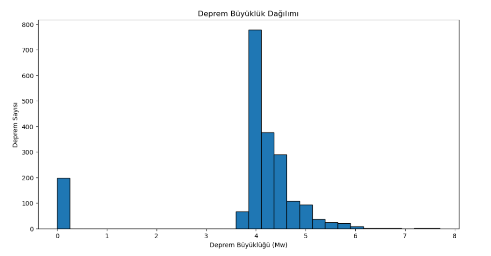
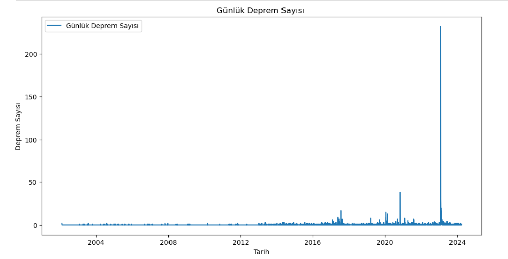
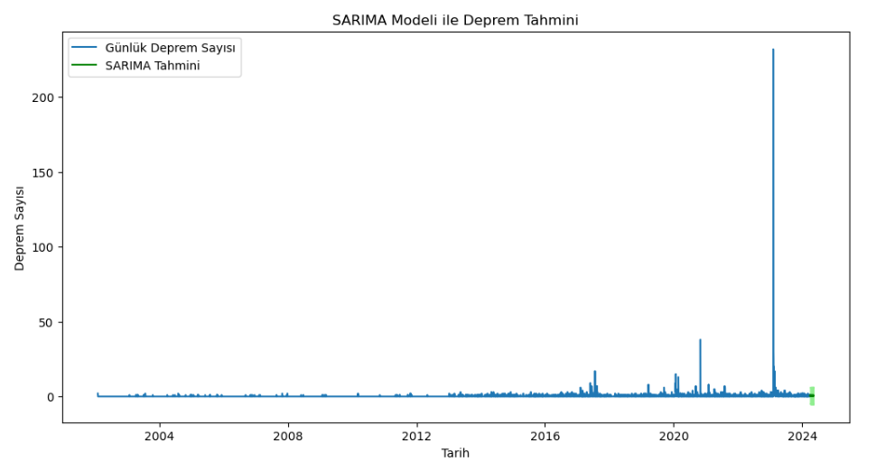
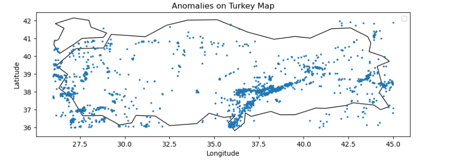

# 🌍 Comprehensive Earthquake Data Analysis & Predictive Modeling

## 📌 Project Overview
Bu proje, Türkiye’deki tarihsel deprem verileri üzerinde kapsamlı veri analizi, zaman serisi modelleme ve makine öğrenmesi uygulamaları içermektedir.

**Temel Amaçlar:**
* Deprem dağılımını istatistiksel olarak incelemek.
* Günlük deprem sayısını tahmin etmek (Forecasting).
* Deprem büyüklüklerini modellemek ve sismik anomali tespiti gerçekleştirmek.

---

## 📊 Data Understanding & Preprocessing
Analitik süreç, verinin güvenilirliğini artırmak adına şu adımları kapsamaktadır:
* **Feature Engineering:** Zaman bazlı analizler için tarih ve saat değişkenleri birleştirilerek `datetime` formatına dönüştürüldü.
* **Cleaning:** Eksik ve tutarsız gözlemler veri setinden temizlendi.
* **Transformation:** Zaman serisi modelleri için günlük deprem frekansları (count) türetildi.

---

## 📈 Exploratory Data Analysis (EDA)
Verinin istatistiksel yapısını ve dağılım özelliklerini anlamak için yapılan analizler:

* **Dağılım Analizi:** Deprem büyüklüğü ($M_w$) ve derinlik ($depth$) değişkenlerinin frekans dağılımları incelenmiştir.
* **Trend Analizi:** Günlük deprem sayısının yıllara göre değişimi, sismik hareketliliğin yoğunlaştığı dönemleri belirlemek için görselleştirilmiştir.

---

## ⏳ Time Series Modeling
Sismik aktivitenin zamansal örüntüsünü çözümlemek amacıyla gelişmiş zaman serisi modelleri kullanılmıştır:
* **ARIMA & SARIMA:** Mevsimsel etkiler ve trend bileşenleri modele dahil edilerek kısa vadeli tahminler üretilmiştir.
* **Evaluation:** Model başarımı geçmiş veriler üzerinden test edilerek doğrulanmıştır.

---

## 🤖 Predictive Modeling – Magnitude Estimation
Coğrafi koordinatlar (Latitude, Longitude) ve derinlik (Depth) bilgileri kullanılarak deprem büyüklüğü tahmini yapılmıştır:
* **Algorithm:** Gradient Boosting Regressor (GBR).
* **Metrics:** Model performansı $RMSE$ ve $R^2$ metrikleri ile değerlendirilmiştir.

---

## 🗺️ Geospatial Visualization
Mekânsal örüntüleri ve riskli bölgeleri belirlemek için coğrafi analiz teknikleri uygulanmıştır:

* **GeoPandas** entegrasyonu ile sismik veriler Türkiye haritası üzerinde koordinat bazlı görselleştirilmiştir.
* Yoğunluk (Kernel Density) analizi ile anomaliler ve sismik odak noktaları yorumlanmıştır.

---

## 🛠 Technologies Used
* **Language:** Python
* **Data Ops:** Pandas, NumPy
* **ML/DL:** Scikit-Learn, TensorFlow / Keras
* **Statistics:** Statsmodels (ARIMA/SARIMA)
* **Visualization:** Matplotlib, Seaborn, GeoPandas

---

## 🎯 Conclusion
Bu çalışma, deprem verilerini sadece görselleştirmekle kalmayıp; istatistiksel yöntemler ve makine öğrenmesi modellerini birleştirerek sismik verinin doğasını anlamayı amaçlar. Proje sonunda elde edilen bulgular, kısa vadeli sismik tahminlerin ve mekânsal anomali tespitinin potansiyelini ortaya koymaktadır.
